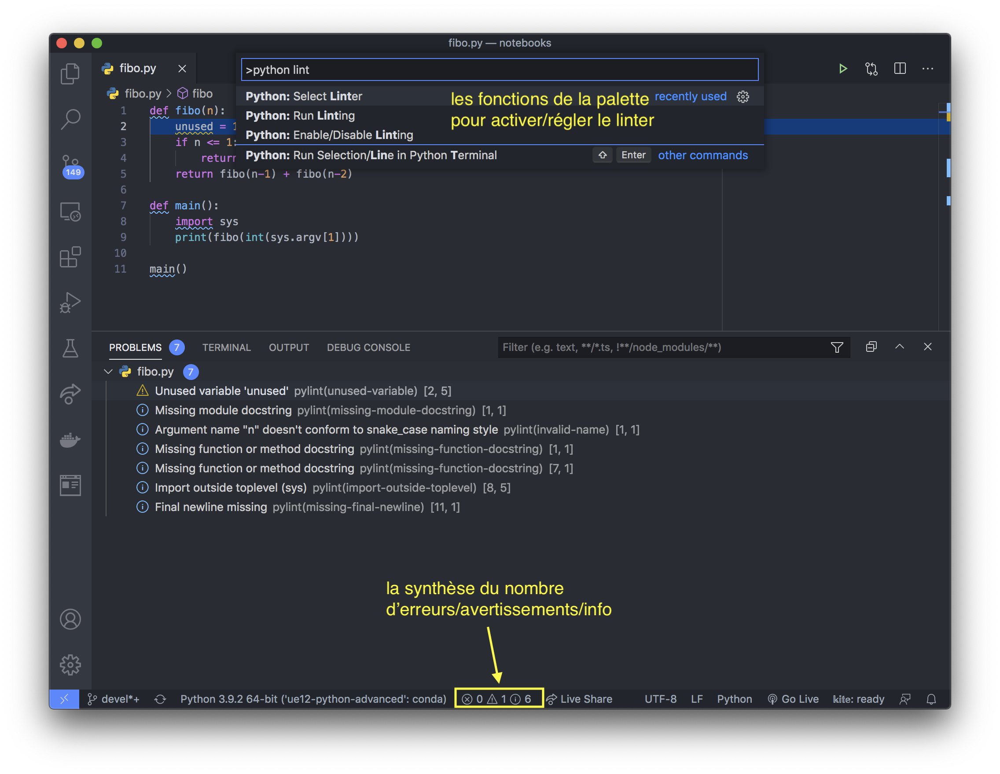

---
jupytext:
  cell_metadata_filter: all,-hidden,-heading_collapsed,-run_control,-trusted
  notebook_metadata_filter: all, -jupytext.text_representation.jupytext_version, -jupytext.text_representation.format_version,
    -language_info.version, -language_info.codemirror_mode.version, -language_info.codemirror_mode,
    -language_info.file_extension, -language_info.mimetype, -toc
  text_representation:
    extension: .md
    format_name: myst
kernelspec:
  display_name: Python 3
  language: python
  name: python3
language_info:
  name: python
  nbconvert_exporter: python
  pygments_lexer: ipython3
nbhosting:
  title: linting
---

# Qualité du code

+++

Après avoir écrit et optimisé un module Python, vous souhaitez le distribuer à la communauté en l'exposant sur github par exemple. Seulement là, vous vous demandez si votre code respecte la PEP8, s'il est cohérent dans le choix de la casse des noms de variables, classes, *et caetera*. Distribuer un code de bonne qualité, c'est s'assurer qu'il soit intelligible et utilisable pour un autre utilisateur (ou même vous dans 2 mois).

+++

On ne va pas se le cacher, si quelqu'un prétend qu'il documente et commente au fur et à mesure de l'écriture du code, **il ment**. Généralement, ça fonctionne par tâtonnements, donc on est pas sûr que le code final ressemblera à notre premier jet (même plutôt sûrs que ce sera assez différent). Heureusement,les outils de **linting** sont là pour nous aider à faire un grand coup de ménage avant de distribuer le code.

+++

## c'est quoi le *linting* ?

+++

Le *linting* c'est une analyse du code comme texte cette fois. Elle a notamment pour but :
 - la vérification du respect de certaines règles (conventions de nommage, ...) ; 
 - la détection d'erreurs grossières (mauvais nombres d'arguments, ...) ; 
 - la détection des variables non utilisées (des restes de vos 352 versions successives de l'algorithme).

**Attention :** le *linting* ne permet pas de s'assurer avec certitude que le code va s'exécuter sans erreur. :(

+++

## en pratique : `pylint`

+++

### Dans VSCode

Il existe plusieurs outils de *linting* pour Python. Aujourd'hui le choix se porte sur `pylint`. On peut l'installer grâce à VSCode :

 - ouvrez la palette (Ctrl/Cmd + Maj + P) ;
 - tapez `python lint` dans la barre de recherche, et selectionnez `Python: Select Linter` ; 
 - choisissez `pylint` (et remarquer les autres linter disponibles) et laissez-vous guider si vous avez besoin de l'installer. 

Si vous ouvrez maintenant un fichier Python (au pif de votre évaluation du S1) vous verrez des "zigouigouis" (c'est le terme technique idoine) apparaître sous certains fragments de code. En approchant la souris du code souligné, un pop-up apparaît et vous explique le problème.



+++

### En ligne de commande

`pylint` peut aussi être utilisé en ligne de commande comme suit :

```{code-cell} ipython3
! pylint fibo.py
```

En ligne de commande, l'utilitaire vous renvoie une note (parfois négative...). Les lignes se lisent comme suit :

`nom du fichier : ligne : indentation : identifiant de l'erreur : message d'explication (nom de l'erreur pylint)`

Le nom entre parenthèses est très utile quand on ne comprend pas le message : il suffit alors de chercher sur votre moteur de recherche préféré 'pylint import-outside-toplevel' pour la dernière ligne par exemple.

+++

## **exercice**

+++

Reprenez votre code de l'évaluation du S1 et calculez votre note globale en tapant : 
```bash
pylint puzzle8/*.py
```
dans votre terminal. 
Prenez un peu de temps pour essayer d'améliorer votre note. :) Arriver à 10/10 peut prendre du temps.

+++ {"tags": ["level_intermediate"]}

## Avancé -- Génération d'un fichier de configuration

Parfois, les conventions de nommage par défaut de pylint ne conviennent pas, ou l'on souhaite éviter d'avoir des avertissement car `x`, `y`, `z` et `t` ne sont pas des bons noms de variable. Il est alors possible de générer un fichier de configuration avec la commande (à lancer dans un terminal): 
```bash
pylint --generate_rcfile > mypylintrc
```

Ouvrez ensuite le fichier généré `pylintrc`. Il contient toutes les valeurs par défaut. Vous pouvez par exemple réduite le nombre de caractères par ligne à 80 en modifiant la ligne suivante :

```
# Maximum number of characters on a single line.
max-line-length=100
```

Ou encore ajouter `x`, `y`, `z` et `t`à la liste des good guys.

```
# Good variable names which should always be accepted, separated by a comma.
good-names=i,
           j,
           k,
           ex,
           Run,
           _
```
puis relancer l'utilitaire : 

```bash
pylint --rcfile=mypylintrc ./puzzle8/*.py
```

On peut ainsi avoir des conventions différentes en fonction des projets. Dans ce cas, `pylint` se débrouille comme un grand pour trouver le fichier de configuration qui doit se trouver à la racine du projet ou dans le répertoire `pylintrc` situé lui-même à la racine du projet.

+++ {"tags": []}

## *see also*

+++

Le site officiel de [pylint](https://www.pylint.org/)

Une petite vidéo (en anglais) sur la [base de pylint](https://www.youtube.com/watch?v=fFY5103p5-c)
